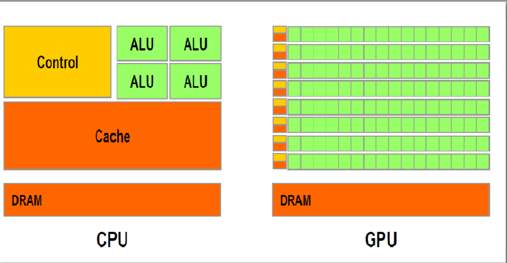

**1.1 Heterogeneous Parallel Computing**
- thread = code of a sequential program, the current point of execution, and the values of its variables and data structures
- a big source of tradeoffs between CPUs and GPUs is limited chip space -- emphasizing different functionality means allocating area on the chip differently
- CPUs: 
	- optimize for reducing thread latency, i.e., sequence of instructions should execute as quickly as possible
	- to do this, they need to have a big cache memory to prevent expensive memory (DRAM) fetches (takes up space on the chip)
	- they also need a lot of complicated logic and fancy arithmetic logic units (ALUs), which take up a good amount of space on the chip
	- because individual processors have stopped getting that much faster, CPU-based architectures has focused more and more on multi-core processing to enable parallelism
- GPUs: 
	- optimize for increasing throughput -- i.e., the number of threads that can be processed at once (rather than the speed of any single thread)
	- do this by having many more ALUs, smaller overall cache (a separate little cache for blocks of ALUs), but more pathways to fetch from DRAM (the latter is still expensive, though)

**1.3 Speeding up real applications**
- speed-up = ratio of code w/o parallelization to code w/ parallelization
- two main factors in speed-up:
	- the fraction of runtime that's taken up by operations that can actually be parallelized
	- how often the code has to fetch memory from DRAM (slow!!)--often need code optimizations to best make use of the available cache memory and avoid additional I/O from DRAM

**1.3 Speeding up real applications**
- speed-up = ratio of code w/o parallelization to code w/ parallelization
- two main factors in speed-up:
	- the fraction of runtime that's taken up by operations that can actually be parallelized
	- how often the code has to fetch memory from DRAM (slow!!)--often need code optimizations to best make use of the available cache memory and avoid additional I/O from DRAM

**1.4 Challenges in parallel programming**
- it's hard to write efficient parallel programs
- recurrence is hard to get right with parallel applications
- another obstacle is memory I/O -- the runtime of software which is *memory bound* is heavily determined by how often it needs to fetch from DRAM
- parallel programs are also typically more sensitive to data characteristics/distribution, so this needs to be handled carefully
- *embarrassingly parallel* programs are ones in which threads don't need to communicate very much, so they're easy to efficiently parallelize, but others require more work to synchronize among threads and reduce overhead