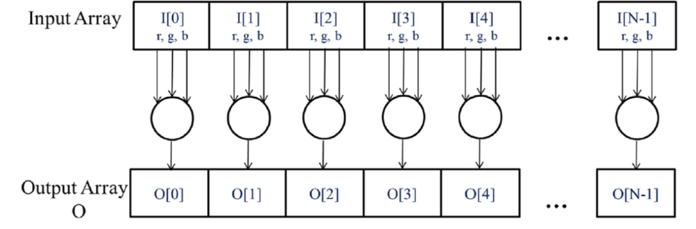
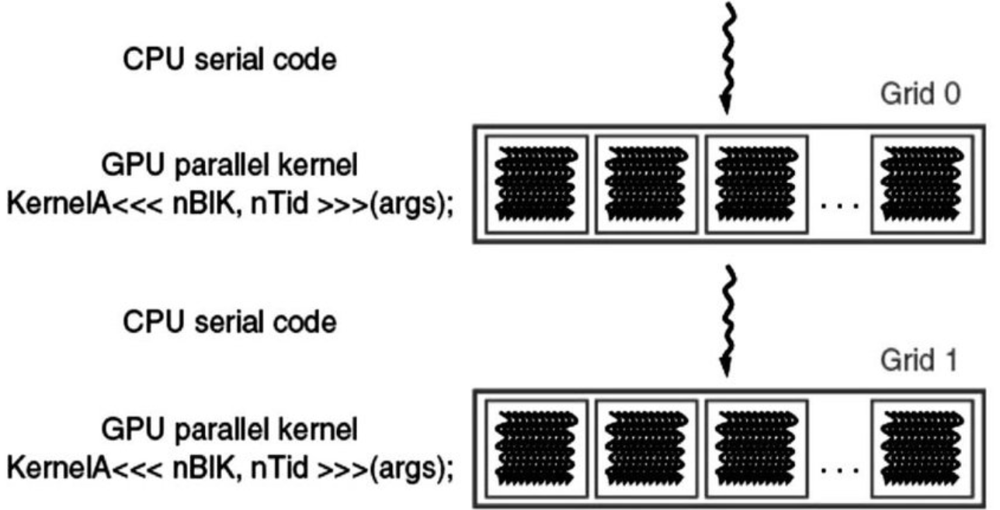

**2.1 Data Parallelism**
- this is when you apply the same program/instruction to separate pieces of data independently 
- example: RGB -> grayscale pixel conversion (each pixel is independent of the others)

- *task parallelism*: another type of parallelism in which you apply instructions in parallel (shocker) --- e.g., you need to a vector addition and a matrix-vector product but one doesn't have to wait for the other to be completed first

**2.2 CUDA C Program Structure**
- CUDA C is just the base language with extra stuff tacked on (also starting to have more C++ features too)
- *host* = CPU, *device* = GPU
- regular C can be seen as just CUDA with only host code
- you can add device code with *kernels,* which place data on device and launch a bunch of parallel threads --- the threads launched by a kernel are called a *grid*

- above is example program, where things start on host, then a kernel launches a grid of threads, then the parallel part is over and control returns to host, etc. in more complicated programs, often have code running on host and device simultaneously
- in the RGB -> grayscale example, the no. of threads would be equal to the no. of pixels in the image

**A vector addition kernel**

- Simple in-place vector addition in regular C:
```c

void vecAdd(float* A_h, float* B_h, float* C_h, int n) {

    for (int i = 0; i < n; ++i) {
        C_h[i] = A_h[i] + B_h[i];
    }
}

int main() {

    // allocate memory on host, etc

    vecAdd(A, B, C, N);
    // ...
}
```

- To write a simple CUDA kernel for the same thing, you have to copy the data from host memory to device memory, launch threads/perform the computation, then copy the result back to host memory and free the memory used on the device

```c

void vecAdd(float* A_h, float* B_h, float* C_h, int n) {
    int size = n * sizeof(float);
    float *A_d, *B_d, *C_d;

    // Part 1: allocate memory on device and copy from host

    // Part 2: actually do the addition

    // Part 3: copy the result back to host and free memory on device
}

```
- Note that in this way of writing things, the actually GPU-y part is totally hidden from the host code. This is called *transparent outsourcing*, which is nice for modularity, but also can be inefficient (e.g., you might want to keep big pieces of data on device for multiple function calls, rather than copying back and forth every time)


**Memory Management**
- A GPU has a certain amount of *global device memory* or just *device memory* (DRAM), e.g., for A100s it's either 40GB or 80GB 
- to allocate and release memory on device, CUDA uses the `cudaMalloc(ptr_address, size)` and `cudaFree(ptr)` functions, where `size` is the number of required bytes, `ptr_address` is the address of a pointer to either put stuff or free stuff from, and `ptr` is a pointer
- these are like `malloc` and `free` in regular C, except `malloc` only takes a `size` input, not a pointer as well 
- once you've allocated memory on device, you can transfer data from the host to the device (or back again, or within-device) using `cudaMemcpy(destination, source, size, <transfer_type>)`, where `<transfer_type>` is either `cudaMemcpyHostToDevice`, `cudaMemcpyDeviceToHost`, or similar for Host-Host transfer or Device-Device transfer