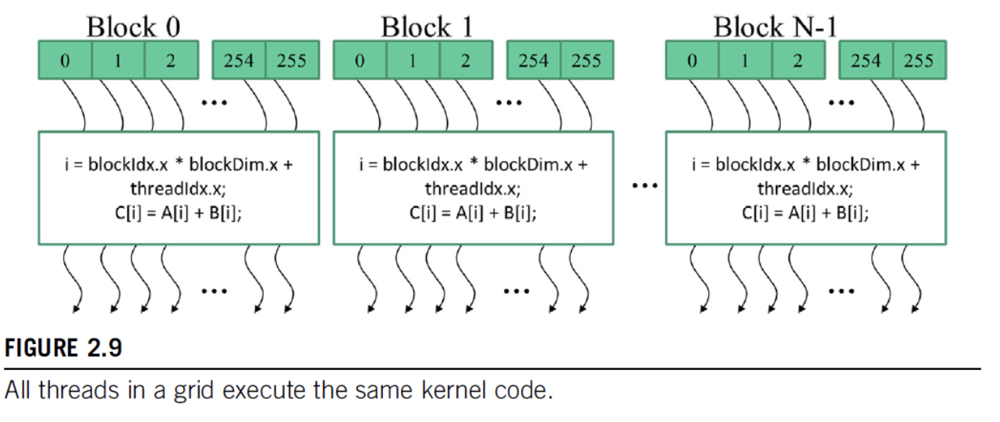

**2.1 Data Parallelism**
- this is when you apply the same program/instruction to separate pieces of data independently 
- example: RGB -> grayscale pixel conversion (each pixel is independent of the others)

- *task parallelism*: another type of parallelism in which you apply instructions in parallel (shocker) --- e.g., you need to a vector addition and a matrix-vector product but one doesn't have to wait for the other to be completed first

**2.2 CUDA C Program Structure**
- CUDA C is just the base language with extra stuff tacked on (also starting to have more C++ features too)
- *host* = CPU, *device* = GPU
- regular C can be seen as just CUDA with only host code
- you can add device code with *kernels,* which place data on device and launch a bunch of parallel threads --- the threads launched by a kernel are called a *grid*

- above is example program, where things start on host, then a kernel launches a grid of threads, then the parallel part is over and control returns to host, etc. in more complicated programs, often have code running on host and device simultaneously
- in the RGB -> grayscale example, the no. of threads would be equal to the no. of pixels in the image

**A vector addition kernel**

- Simple in-place vector addition in regular C:
```c

void vecAdd(float* A_h, float* B_h, float* C_h, int n) {

    for (int i = 0; i < n; ++i) {
        C_h[i] = A_h[i] + B_h[i];
    }
}

int main() {

    // allocate memory on host, etc

    vecAdd(A, B, C, N);
    // ...
}
```

- To write a simple CUDA kernel for the same thing, you have to copy the data from host memory to device memory, launch threads/perform the computation, then copy the result back to host memory and free the memory used on the device

```c

void vecAdd(float* A_h, float* B_h, float* C_h, int n) {
    int size = n * sizeof(float);
    float *A_d, *B_d, *C_d;

    // Part 1: allocate memory on device and copy from host

    // Part 2: actually do the addition

    // Part 3: copy the result back to host and free memory on device
}

```
- Note that in this way of writing things, the actually GPU-y part is totally hidden from the host code. This is called *transparent outsourcing*, which is nice for modularity, but also can be inefficient (e.g., you might want to keep big pieces of data on device for multiple function calls, rather than copying back and forth every time)


**2.4 Device Global Memory and Data Transfer**
- A GPU has a certain amount of *global device memory* or just *device memory* (DRAM), e.g., for A100s it's either 40GB or 80GB 
- to allocate and release memory on device, CUDA uses the `cudaMalloc(ptr_address, size)` and `cudaFree(ptr)` functions, where `size` is the number of required bytes, `ptr_address` is the address of a pointer to either put stuff or free stuff from, and `ptr` is a pointer
- these are like `malloc` and `free` in regular C, except `malloc` only takes a `size` input, not a pointer as well 
- once you've allocated memory on device, you can transfer data from the host to the device (or back again, or within-device) using `cudaMemcpy(destination, source, size, <transfer_type>)`, where `<transfer_type>` is either `cudaMemcpyHostToDevice`, `cudaMemcpyDeviceToHost`, or similar for Host-Host transfer or Device-Device transfer

**2.5 Kernel Functions and Threading**
- kernel functions specify the code that each thread executes during the parallel phase
- this is an example of *single program multiple data* (SPMD) --- distinct from SIMD because each thread doesn't have to be on the same instruction within the kernel at the same time
- when a kernel executes, it launches a grid of threads that are organized into *blocks*, where each block contains a subset of threads. on current GPUs, blocks can contain up to 1024 threads
- threads are accessible via three built-in variables: `blockIdx` (which block are you in), `blockDim` (how many threads are in the block), and `threadIdx` (which thread within the block is this). each of these are themselves structs which have three fields `x`, `y`, and `z`, which are like coordinates in case of multidimensional data (i.e., if you are only dealing with 1d vectors, you only need `blockIdx.x` to specify your block). then the overall thread can be identified by `blockIdx.x * blockDim.x + threadIdx.x`. 

- to actually write a kernel function, you specify it with a header, either `__host__` (code executed on host and called by host--this is just a regular C function, and not providing a header defaults to `__host__`), `__device__` (code executed on device and called on-device), or `__global__` (code executed on-device and called from either host or device)
```c
__global__
void vecAddKernel(float* A, float* B, float* C, int n) {
    // get the thread id
    int i = blockIdx.x * blockDim.x + threadIdx.x; 
    // since you launch threads in a grid divided into blocks, 
    // you can't order "partial" blocks, so you can end up with extra threads
    // so you have to make sure the thread id actually fits within the vector
    // limits
    if (i < n) {
        C[i] = A[i] + B[i]; 
    }
}
```
- you can also write both `__host__` and `__device__` and two copies of the function will be created, one for host execution and one for device execution

**2.6 Calling Kernel Functions**
- To call a kernel function, you add *configuration parameters* which specify how many blocks you need and how big each block should be into the function call using `<<<` and `>>>`, e.g., `vecAddKernel<<<n_blocks, block_size>>>(A, B, C, n)`
- you can't make any assumptions about the execution order of the threads
- actually running the vector addition kernel in this case is likely to be slower than the standard sequential running on host because the amount of overhead involved with allocating and de-allocated device memory and copying data to andn from device is pretty big in comparison to the amount of work the kernel is actually doing

**2.7 Compilation**
- host and device code is compiled separately via NVCC compiler
  - host program is compiled into host code like normal C
  - device program is turned into PTX code and given to a device JIT compiler