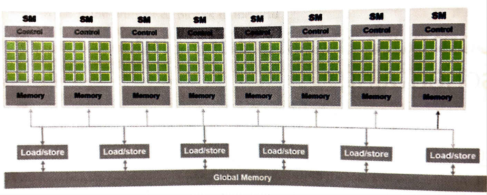
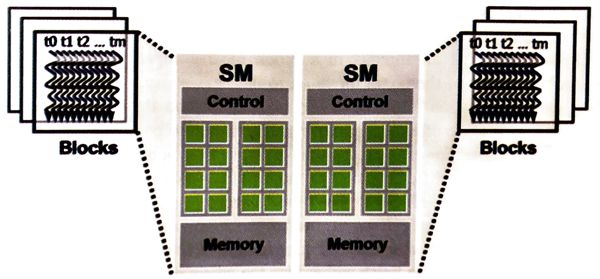

# Chapter 4: Computer Architecture and Scheduling

## 4.1 Architecture of a modern GPU

- above is a high-level view of a CUDA-capable GPU
- it's organized into an array of highly threaded *streaming multiprocessors* (SMs), each of which contains a bunch of processing units called *CUDA cores* or just *cores* (the green blocks)
- all cores within an SM share control logic and memory resources
- e.g., an A100 has 108 SMs with 64 cores each
- In addition to local memory on the SM, the GPU has a global off-chip device memory with tight integration with the SMs---this is the DRAM, usually *high-bandwidth memory* (HBM) in the newest GPUs

