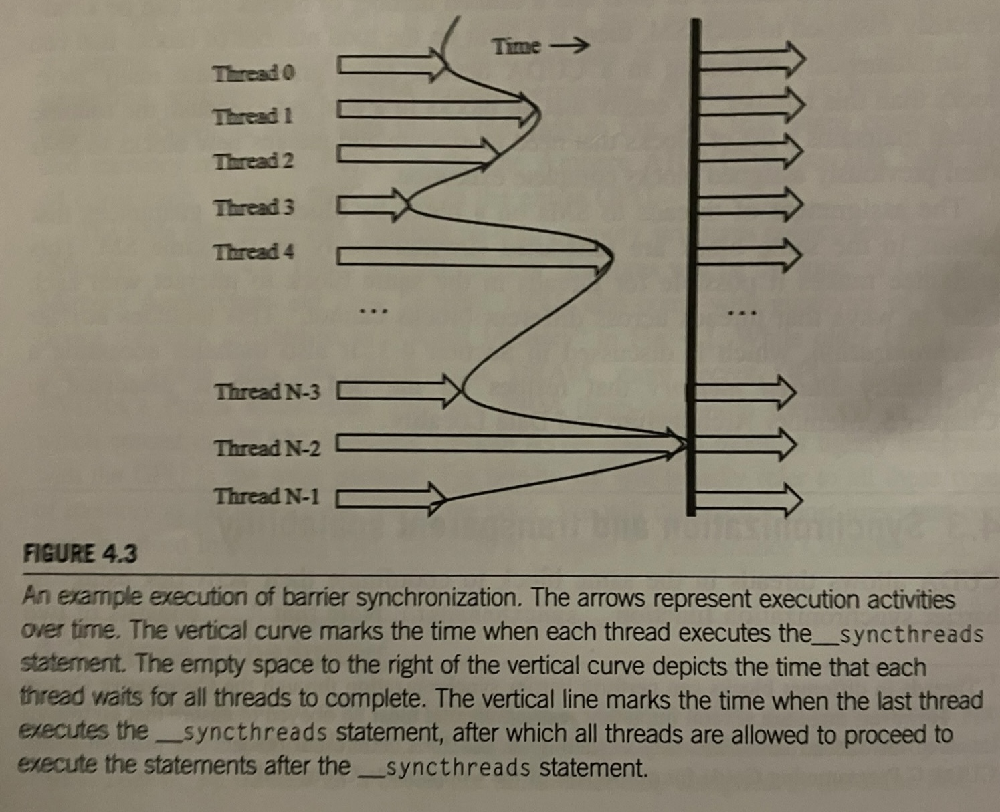

# Chapter 4: Computer Architecture and Scheduling

## 4.1 Architecture of a modern GPU

- above is a high-level view of a CUDA-capable GPU
- it's organized into an array of highly threaded *streaming multiprocessors* (SMs), each of which contains a bunch of processing units called *CUDA cores* or just *cores* (the green blocks)
- all cores within an SM share control logic and memory resources
- e.g., an A100 has 108 SMs with 64 cores each
- In addition to local memory on the SM, the GPU has a global off-chip device memory with tight integration with the SMs---this is the DRAM, usually *high-bandwidth memory* (HBM) in the newest GPUs


## 4.2 Block scheduling


- when a kernel is called, the CUDA runtime system launches a grid of threads divided into blocks
- all threads within a block are always scheduled simultaneously on the same SM
- often the grid contains more blocks than can simultaneously execute across SMs, so the runtime system tracks which are running and which still need to be assigned
- because threads within a block are launched together and share hardware resources, it's relatively easy to facilitate their interaction via *synchronization* (4.3) and/or *shared memory* (ch. 5) 


## 4.3 Synchronization and transparent scalability

- CUDA allows threads within a block to communication with one another using barrier synchronization
- when a thread reaches a call to `__syncthreads()`, it will wait there for the rest of the threads within ints block to reach the same point---this allows for the sharing of information
- one important characeristic of `__syncthreads()` is that using it within `if-else` statements can lead to undefined behavior. in the example below
```c
void incorrect_barrier(int n) {
    ...
    if (threadIdx.x % 2 == 0) {
        ...
        __syncthreads()
    }
    else {
        ...
        __syncthreads()
    }
}
```
either all the threads in the block will execute the `if` path or the `else` path
- this kind of set-up can also lead to deadlocks if threads are waiting for a condition to be true before proceeding
- the runtime system also has to make sure each thread actually gets the resources it needs to complete execution, because if a thread gets stuck, this will also lead to a deadlock
- the runtime system satisfies these constraints by assigning resources to all threads in a block as a unit, and simultaneous execution ensures that wait times aren't too long
- one advantage of this segregation of resources by block is modularity---none of the blocks has to wait for another, so they can be executed in any order
- this gives the system flexibility in scheduling--for low-power systems like mobile devices, only a few blocks may execute at a time, but in more powerful devices, more blocks can be executed simultaneously
- this facilitates *transparent scalability*: the ability to execute the same code on different hardware
